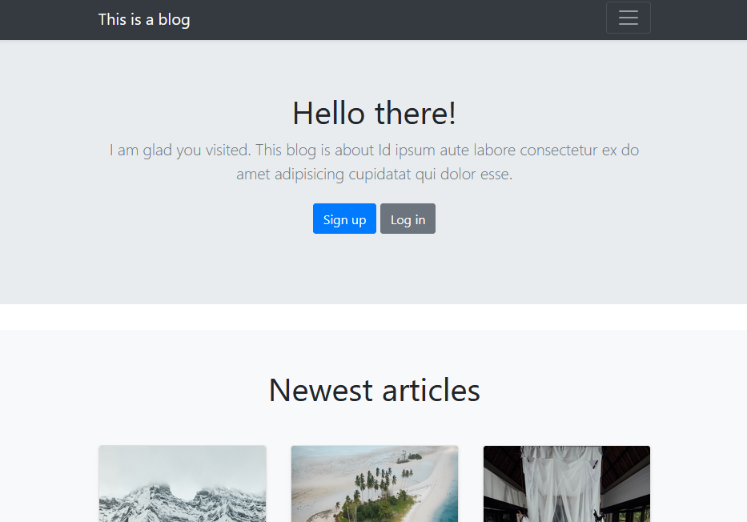
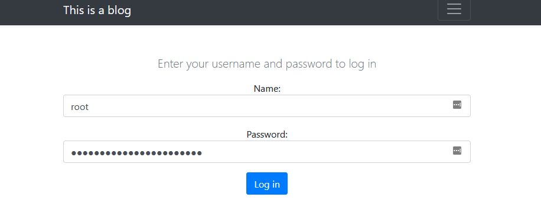
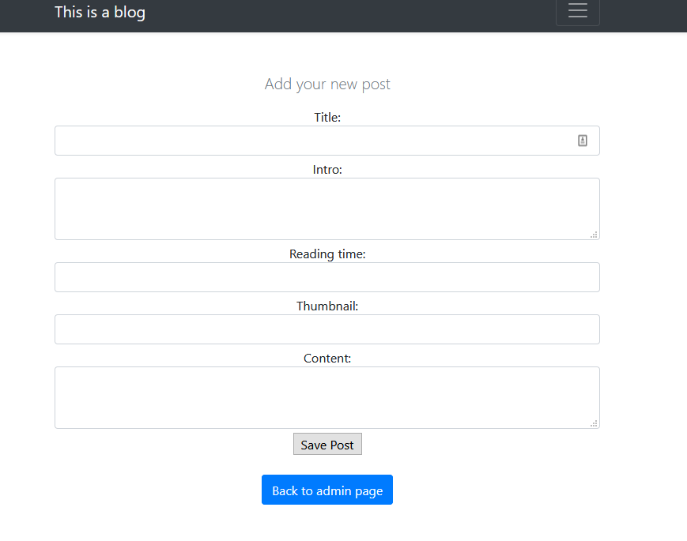
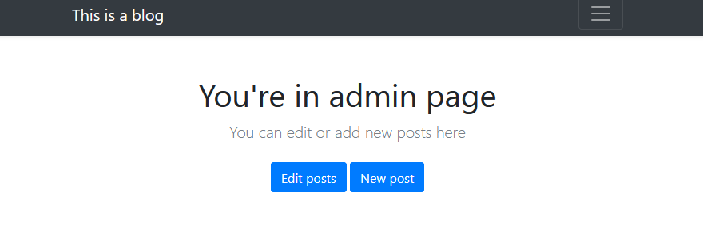
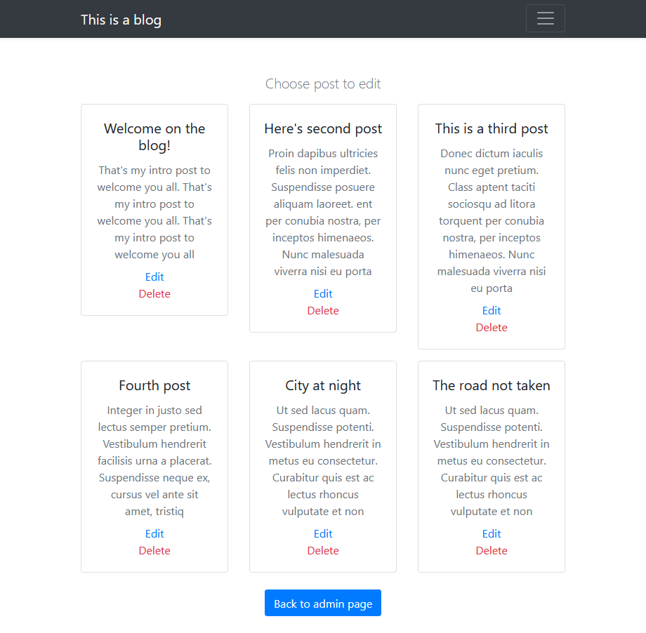

# README

The blog made using Ruby on Rails + MySQL + Bootstrap

### Ruby version
* Ruby installed: 2.7.0
* Rails installed: 6.0.2.1

### System dependencies
* Mysql installed
### Configuration

Now save credentials to mysql
`EDITOR="nano" rails credentials:edit` # or any editor
```
development:
    mysql_username: name
    mysql_password: pwd
```

In database.yml config reference the credentials:
`username: <%= Rails.application.credentials.dig(:development, :mysql_username) %>`

When credentials are properly configured run `rake db:create`
then create posts model:
`rails g model post title:string intro:text reading_time:integer thumbnail_url:string content:text`
`rails g model user name:string pwd_hash:string`
and run `rake db:migrate`

Functonalities made:
- [x] Index Page
- [x] User creation
- [x] Admin login, admin page:
- [x] adding posts
- [x] deleting posts
- [ ] editing posts
- [x] Display of few newest articles from database

# Images:
## Landing page

## Newest articles

## Sign in page

## Adding new post

## Admin page

## Edit view
